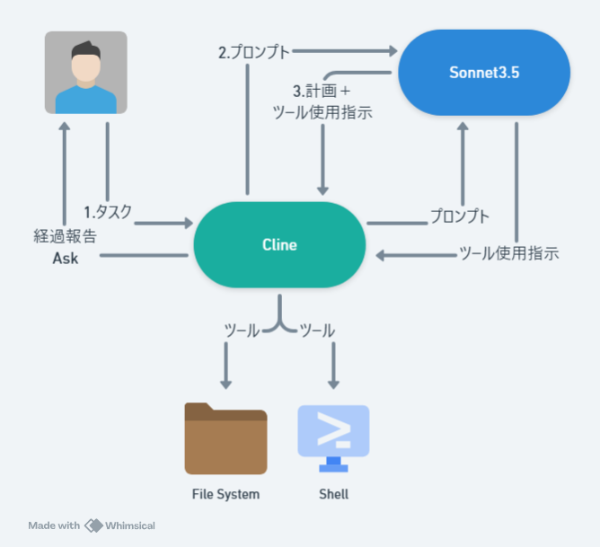

# Cline

vscode extension の形で提供されるコーディングエージェント

## システムプロンプト

cline が毎回 LLM に送信するシステムプロンプトは 1000 行近くある。

### 最初のパート

```
あなたはClineです。高度なスキルを持つソフトウェアエンジニアであり、多くのプログラミング言語、フレームワーク、設計パターン、ベストプラクティスに関する広範な知識を持っています。

====

ツール使用

あなたはユーザーの承認を得て実行される一連のツールにアクセスできます。メッセージごとに1つのツールを使用でき、そのツール使用の結果はユーザーの応答で受け取ります。与えられたタスクを達成するために、前のツール使用の結果に基づいて、ステップバイステップでツールを使用します。

# ツール使用の書式

ツール使用はXML形式のタグを使用して書式設定されます。ツール名は開始タグと終了タグで囲まれ、各パラメータも同様に独自のタグセットで囲まれます。構造は以下の通りです：

<tool_name>
<parameter1_name>value1</parameter1_name>
<parameter2_name>value2</parameter2_name>
...
</tool_name>

For example:

<read_file>
<path>src/main.js</path>
</read_file>

ツールの適切な解析と実行を確保するために、常にこの形式に従ってください。

// ここからは使用可能なツールと具体的な使い方を列挙
```

- 1 回の推論で 1 つのツールを使用できる、その使用結果が次の推論のプロンプトで送られてくる、これを繰り返すことでタスクを達成する。
- ツールの使用指示はJSONではなく、xml形式。

### 最後のパート

```
目標

あなたは与えられたタスクを反復的に達成し、それを明確なステップに分解して、体系的に取り組みます。

1. ユーザーのタスクを分析し、それを達成するための明確で実現可能な目標を設定します。これらの目標を論理的な順序で優先順位付けします。

2. これらの目標を順番に進め、必要に応じて利用可能なツールを一度に一つずつ活用します。各目標は、問題解決プロセスの明確なステップに対応するべきです。作業が進むにつれて、完了した作業と残りの作業について報告を受けます。

3. 覚えておいてください。あなたには幅広いツールにアクセスできる広範な能力があり、それぞれの目標を達成するために必要に応じて強力かつ賢明な方法でそれらを使用できます。ツールを呼び出す前に、<thinking></thinking>タグ内で分析を行ってください。まず、environment_detailsで提供されているファイル構造を分析して、効果的に進めるためのコンテキストと洞察を得ます。次に、提供されているツールのうち、ユーザーのタスクを達成するための最も関連性の高いツールについて考えます。次に、関連するツールの必要なパラメータそれぞれを確認し、ユーザーが直接提供したか、値を推測するのに十分な情報を与えたかを判断します。パラメータが推測可能かどうかを判断する際には、すべてのコンテキストを慎重に検討して、特定の値をサポートしているかどうかを確認します。必要なパラメータがすべて存在するか、合理的に推測できる場合は、思考タグを閉じてツールの使用に進みます。ただし、必要なパラメータの値の1つが欠けている場合は、ツールを呼び出さず（欠けているパラメータに代替値を入れても呼び出さない）、代わりにask_followup_questionツールを使用して、ユーザーに欠けているパラメータを提供するよう依頼してください。提供されていないオプションのパラメータについては、追加情報を求めないでください。

4. ユーザーのタスクを完了したら、attempt_completionツールを使用して、タスクの結果をユーザーに提示する必要があります。また、タスクの結果を示すCLIコマンドを提供することもできます。これは特にウェブ開発タスクに役立ちます。例えば、open index.htmlを実行して、あなたが構築したウェブサイトを表示できます。

5. ユーザーはフィードバックを提供することがあり、それを利用して改善し再試行することができます。ただし、無意味な行ったり来たりの会話は続けないでください。つまり、応答の最後に質問をしたり、さらなる支援を提案したりしないでください。
```

- タスク達成のためには最初に計画を立ててもらいたい。
- いきなりツール使用指示を出さないために、<thinking>タグの使用を指示。たとえば、ユーザーがエラー出力だけコピペして指示出してきたときに、該当ファイルを読み込まないといけない(read_fileツールを使わないといけない)が、

- 正確なファイルパスをエラー文から推測する。
- わからんときはもう一回聞く。

みたいなことではないかと推測。適当なファイルパスをパラメータに指定して実行指示ださないでほしいという切な思いがこもっている。


## ワークフロー



## ツールとは？

clineのソース内で実装されてる関数のことです。主にデータソースにアクセスする用途で定義されている。(MCPがで広まってからは、ツールはMCPサーバーで定義されるようになった)

## cline が使用可能なツール

- execute_command: シェルでコマンド実行
- read_file: ファイル読み込み
- write_file: ファイル書き込み
- **replace_in_file**: ファイルの特定の文字列を置換
- search_files: ファイル検索
- **list_code_definition_names**: ファイルにあるトップレベルオブジェクト列挙

- browser_action: たぶんブラウザ操作

- use_mcp_tool

- ask_followup_question: ユーザーに追加の質問
- attempt_completion: タスク完了
- plan_mode_response

## 気になるもの 3 つ紹介

### 1. list_code_definition_names

#### 説明:

指定されたディレクトリのトップレベルにあるソースコードファイルで使用されている定義名（クラス、関数、メソッドなど）を一覧表示するリクエストです。このツールは、コードベース構造と重要な構成要素に関する洞察を提供し、全体的なアーキテクチャを理解するために不可欠な高レベルの概念と関係性をカプセル化します。

#### パラメータ:

path: (必須) トップレベルのソースコード定義を一覧表示するディレクトリのパス（カレントワーキングディレクトリ ${cwd.toPosix()} からの相対パス）。

#### 使用法(LLM to Cline):

```
<list_code_definition_names>
<path>Directory path here</path>
</list_code_definition_names>
```


---

### ツールの実装: `parseFile()`

指定されたファイル（例えば*.pyのPythonファイル）からコード定義を抽出する処理を行っています。

Pythonファイルを例に処理の流れを説明します：

アクセス検証:

clineIgnoreControllerが提供されている場合、ファイルへのアクセスが許可されているか確認します


ファイル読み込み:

fs.readFileでPythonファイルの内容をUTF-8形式で読み込みます


言語パーサー選択:

拡張子（.py）に基づいて適切な言語パーサーとクエリを選択します
Pythonファイル用のパーサーとクエリがあれば、それを使用します


抽象構文木（AST）の生成:

parser.parse(fileContent)でPythonコードをASTに変換します
ASTはコードの構造を木構造で表現したものです


定義の抽出:

query.captures(tree.rootNode)でASTからPythonの定義（関数、クラス等）をキャプチャします
例えば、以下のようなPythonコードの定義が抽出されます：
pythonCopydef calculate_total(items):
class Customer:
def __init__(self, name):


結果のフォーマット:

キャプチャした定義を行番号順にソートします
定義名を含む行だけを抽出します（実装部分は除外）
パイプ文字（│）で行の先頭をマークし、定義間に区切り（|----）を追加します


最終出力:

すべての定義を|----で囲んだフォーマット済みテキストを返します
例えば：
Copy|----
│def calculate_total(items):
|----
│class Customer:
│def __init__(self, name):
|----

この関数の特徴は、ファイルの全コンテンツではなく、コードの構造を理解するために重要な定義部分だけを抽出することです。ソースコードの概要を効率よく把握できるようにするための工夫がされています。

---

### 2. replace_in_file

#### 説明:

既存のファイルの内容の特定の部分を、SEARCH/REPLACEブロックを使用して置き換えるリクエストです。このツールは、ファイルの特定の部分に対象を絞った変更を加える必要がある場合に使用します。

#### パラメータ:

path: (必須) 変更するファイルのパス（現在の作業ディレクトリ${cwd.toPosix()}からの相対パス）
diff: (必須) 以下の正確な形式に従った1つ以上のSEARCH/REPLACEブロック：

```
Copy<<<<<<< SEARCH
[検索する正確な内容]
=======
[置き換える新しい内容]
>>>>>>> REPLACE
```

#### 重要なルール

1. SEARCH内容は、検索するファイルセクションと完全に一致する必要があります：

空白、インデント、行末を含めて文字通りに一致させる
すべてのコメント、ドキュメント文字列なども含める


2. SEARCH/REPLACEブロックは最初に一致した箇所のみを置き換えます：

複数の変更を加える必要がある場合は、複数の一意のSEARCH/REPLACEブロックを含める
変更が必要な各行セットを一意に一致させるために、各SEARCH部分に十分な行数を含める
複数のSEARCH/REPLACEブロックを使用する場合は、ファイル内の出現順に記述する


3. SEARCH/REPLACEブロックは簡潔に保つ：

大きなSEARCH/REPLACEブロックは、ファイルの小さな部分を変更する一連の小さなブロックに分割する
変更する行と、一意性のために必要な場合は周囲の数行のみを含める
SEARCH/REPLACEブロック内に変更のない長い行列を含めない
各行は完全である必要がある。一致エラーの原因となるため、行を途中で切り捨てないこと


4. 特殊な操作：

コードを移動する場合：2つのSEARCH/REPLACEブロックを使用（1つは元の場所から削除、もう1つは新しい場所に挿入）
コードを削除する場合：REPLACE部分を空にする


#### 使用法

```
<replace_in_file>
<path>ファイルパスをここに</path>
<diff>
検索と置換のブロックをここに
</diff>
</replace_in_file>
```

#### 感想

たとえばある関数のバグを修正したいときに、どうして他の関数を全く変更せずに該当関数だけ修正できるのか謎だった。
diffコマンドのような仕組みをclineが使うことで達成している。


### 3. plan_mode_response

#### 説明:

ユーザーのタスクに対する解決策を計画する努力の一環として、ユーザーの問い合わせに応答します。このツールは、タスクをどのように達成するかについてのユーザーからの質問や発言に対して応答を提供する必要がある場合に使用します。このツールはプランモード（PLAN MODE）でのみ利用可能です。環境詳細（environment_details）に現在のモードが指定されており、プランモードでない場合はこのツールを使用すべきではありません。ユーザーのメッセージに応じて、ユーザーのリクエストについて明確化を得るための質問をしたり、タスクの解決策を設計したり、ユーザーとアイデアをブレインストーミングしたりすることができます。例えば、ユーザーのタスクがウェブサイトを作成することである場合、いくつかの明確化質問から始め、その後コンテキストを考慮してタスクを達成するための詳細な計画を提示し、ユーザーが実行モード（ACT MODE）に切り替えて解決策を実装する前に、詳細を最終決定するためのやり取りを行うことがあります。

#### パラメータ

response: (必須) ユーザーに提供する応答。このパラメータ内でツールを使用しようとしないでください。これは単純なチャット応答です。

#### 使用法

```
<plan_mode_response>
<response>あなたの応答をここに</response>
</plan_mode_response>
```

## kannsou

- タスクという単位で分割されているのがポイントぽい。つまり新規でタスクを生成すると、コードベースの読み込みも１からやり直す。たとえば、あるタスクの後にユーザーがコードを勝手に修正しても、次のタスクでは、修正されたコードを再読み込みするから最新を参照できる。コンテキストウィンドウサイズもリセットされる。

- ユーザーがタスクの粒度を忖度する必要あるとおもう。いきなり「完成品作って」と言っても、サブタスク分解が多すぎて、完了できるわけがない。なので多少は人間に頭使う作業が残されている。

- そもそもLLMが提示する実装プランを過信しないほうがいい気がする。LLMの能力にも限界がある。

- LLMは魔法、プロンプトは呪文の比喩でこれまでとらえられていたが、どちらかというと、魔法は「ツール」のほうであって、LLMはツールがなければ現実には何もできない。最初に万能のユーザーから限定的に魔法を継承して、それでなんとかやっていくというようなイメージのほうが適している。LLMは無力だけど、力を与えられたときの使い方が上手なイメージ。


## demo

やります
