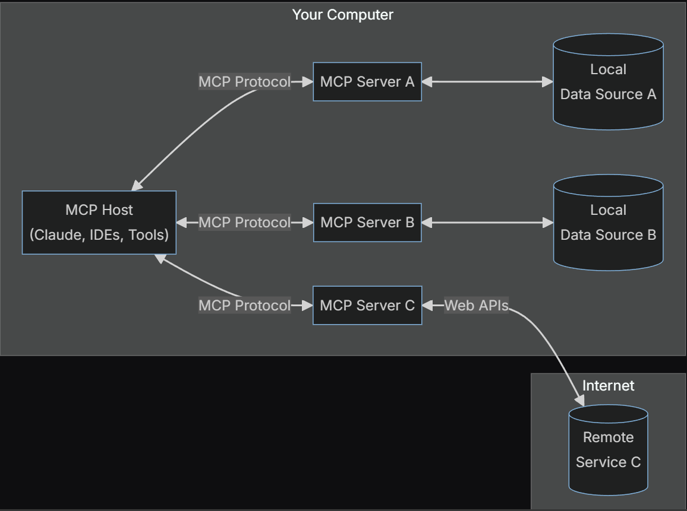
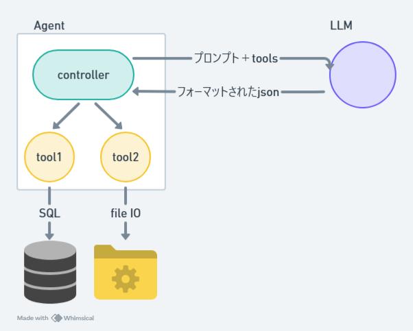
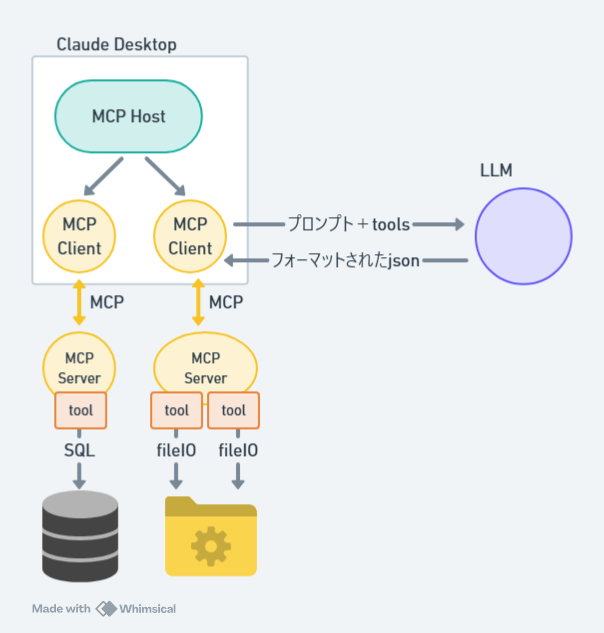

# コンテンツ
1. MCPとはなにか
2. MCPなにがあつい？
3. 登場人物
4. どんなデータソースを操作するサーバーがある？
5. 個々のサーバーは何を提供する？
6. Claude Desktop によるファイルシステムと.gitレポジトリ操作実演


## MCP(Model Context Protocol)とはなにか
LLMのインプットに必要なデータをデータソースから適切に取得するためのプロトコル。Anthropic主導で策定。
- [一次資料](https://github.com/modelcontextprotocol)



## MCPなにがあつい？
### MCP以前


データーソースへのアクセスを自前で実装しなくてはならなかった
たとえば git repository を例に挙げると、

- LLM 以前：各種 git command に精通している必要があった
- MCP 以前：自然言語によるインターフェイスで function calling のようなものを介して git command を実行してもらえるようになったが、その処理関数は自分で作る必要があった
- MCP 以後：サーバーを利用することで、自然言語だけで git repository を操作できるようになった

今まではデータソースからデータを抽出する処理を自力で書いていた(たとえば RAG)が、今度は人が書いたものを流用できる。


### MCP以後


サーバーを自分で作る必要がなくなった

## 登場人物
### 1. MCP ホスト

Claude Desktop や IDEs、AI ツールなど、MCP を通じてデータにアクセスしたいプログラム

- ホストプロセスは、コンテナおよび調整役として機能します:
  - 複数のクライアントインスタンスを作成し管理
  - クライアント接続の権限およびライフサイクルを制御
  - セキュリティポリシーと同意要件を強制
  - ユーザー認可の決定を処理
  - AI/LLM の統合とサンプリングを調整
  - クライアント間のコンテキスト統合を管理

### 2. MCP クライアント

サーバーと 1 対 1 の接続を維持するプロトコルクライアント

- 各クライアントはホストによって作成され、独立したサーバー接続を維持します:
  - サーバーごとに 1 つの状態管理セッションを確立
  - プロトコル交渉と機能交換を処理
  - プロトコルメッセージを双方向にルーティング
  - サブスクリプションと通知を管理
  - サーバー間のセキュリティ境界を維持

### 3. MCP サーバー

標準化された`Model Context Protocol`を通じて特定の機能を提供する軽量プログラム

- サーバーは特化したコンテキストと機能を提供します:
  - MCP プリミティブを通じてリソース、ツール、プロンプトを公開
  - 独立して動作し、特定の責任に集中
  - クライアントインターフェースを介してサンプリングを要求
  - セキュリティ制約を遵守する必要がある
  - ローカルプロセスまたはリモートサービスとして動作可能

### 4. ローカルデータソース

MCP サーバーが安全にアクセスできる、コンピュータ上のファイル、データベース、サービス

### 5. リモートサービス

MCPサーバーが接続できる、インターネット上で利用可能な外部システム（例: WEB API 経由）


## どんなデータソースを操作するサーバーがある？

[サーバーリファレンス実装一覧](https://github.com/modelcontextprotocol/servers)

- AWS KB Retrieval - Bedrock Agent Runtime を使用した AWS ナレッジベースの取得
- Brave Search - Brave の Search API を使用したウェブおよびローカル検索
- EverArt - 多様なモデルを使用した AI 画像生成
- Everything - プロンプト、リソース、ツールを備えたリファレンス／テストサーバー
- Fetch - 効率的な LLM 利用のためのウェブコンテンツの取得と変換
- Filesystem - 設定可能なアクセス制御による安全なファイル操作
- Git - Git リポジトリの読み取り、検索、操作ツール
- GitHub - リポジトリ管理、ファイル操作、GitHub API 統合
- GitLab - プロジェクト管理を可能にする GitLab API
- Google Drive - Google Drive のファイルアクセスおよび検索機能
- Google Maps - 位置情報サービス、経路案内、場所の詳細情報
- Memory - 知識グラフに基づく永続的なメモリシステム
- PostgreSQL - スキーマ検査を伴うデータベースの読み取り専用アクセス
- Puppeteer - ブラウザの自動操作とウェブスクレイピング
- Sentry - Sentry.io からの問題の取得と分析
- Sequential Thinking - 思考の連続による動的かつ反射的な問題解決
- Slack - チャンネル管理とメッセージ機能
- Sqlite - データベース操作およびビジネスインテリジェンス機能
- Time - 時間とタイムゾーンの変換機能

これらは公式のレファレンス実装がすでにあるものの一例であって、今後いくらでも新しいサーバー実装がサードパーティから作られる
サードパーティ製でもできのよいサーバーだと人気になりそう。


## 個々のサーバーは何を提供する？

- Resources: クライアントが読み取れるファイルのようなデータ（API レスポンスやファイル内容など）
- Tools: LLM が呼び出せる関数（ユーザー承認が必要）
- Prompts: ユーザーが特定のタスクを達成するのを支援するための事前に書かれたテンプレート


### 詳細
#### MCPメッセージの構成要素
MCPは、JSON-RPC 2.0に基づいた3つの主要なメッセージタイプを定義しています:

リクエスト (Requests): メソッドとパラメータを含む双方向メッセージで、レスポンスを期待する
レスポンス (Responses): 特定のリクエストIDに対応する成功結果またはエラー
通知 (Notifications): レスポンスを必要としない一方向メッセージ
各メッセージタイプは、構造および配信セマンティクスに関してJSON-RPC 2.0の仕様に準拠しています。

#### クライアントは次のような形でメソッドをリクエストする

- `resources/list`
- `resources/read paramter`
- `tools/call parameter`
- `tools/list`

- サーバーもクライアントも typescript, python の SDK を利用してを実装することができる(それ以外の言語は SDK なし)


#### 以下はファイルシステムを提供するMCPサーバーのレファレンス実装

```js
// Tool handlers
server.setRequestHandler(ListToolsRequestSchema, async () => {
  return {
    tools: [
      {
        name: "read_file",
        description:
          "Read the complete contents of a file from the file system. " +
          "Handles various text encodings and provides detailed error messages " +
          "if the file cannot be read. Use this tool when you need to examine " +
          "the contents of a single file. Only works within allowed directories.",
        inputSchema: zodToJsonSchema(ReadFileArgsSchema) as ToolInput,
      },
      {
        name: "read_multiple_files",
        description:
          "Read the contents of multiple files simultaneously. This is more " +
          "efficient than reading files one by one when you need to analyze " +
          "or compare multiple files. Each file's content is returned with its " +
          "path as a reference. Failed reads for individual files won't stop " +
          "the entire operation. Only works within allowed directories.",
        inputSchema: zodToJsonSchema(ReadMultipleFilesArgsSchema) as ToolInput,
      },
      {
        name: "write_file",
        description:
          "Create a new file or completely overwrite an existing file with new content. " +
          "Use with caution as it will overwrite existing files without warning. " +
          "Handles text content with proper encoding. Only works within allowed directories.",
        inputSchema: zodToJsonSchema(WriteFileArgsSchema) as ToolInput,
      },
      {
        name: "edit_file",
        description:
          "Make line-based edits to a text file. Each edit replaces exact line sequences " +
          "with new content. Returns a git-style diff showing the changes made. " +
          "Only works within allowed directories.",
        inputSchema: zodToJsonSchema(EditFileArgsSchema) as ToolInput,
      },
      {
        name: "create_directory",
        description:
          "Create a new directory or ensure a directory exists. Can create multiple " +
          "nested directories in one operation. If the directory already exists, " +
          "this operation will succeed silently. Perfect for setting up directory " +
          "structures for projects or ensuring required paths exist. Only works within allowed directories.",
        inputSchema: zodToJsonSchema(CreateDirectoryArgsSchema) as ToolInput,
      },
      {
        name: "list_directory",
        description:
          "Get a detailed listing of all files and directories in a specified path. " +
          "Results clearly distinguish between files and directories with [FILE] and [DIR] " +
          "prefixes. This tool is essential for understanding directory structure and " +
          "finding specific files within a directory. Only works within allowed directories.",
        inputSchema: zodToJsonSchema(ListDirectoryArgsSchema) as ToolInput,
      },
      {
        name: "directory_tree",
        description:
            "Get a recursive tree view of files and directories as a JSON structure. " +
            "Each entry includes 'name', 'type' (file/directory), and 'children' for directories. " +
            "Files have no children array, while directories always have a children array (which may be empty). " +
            "The output is formatted with 2-space indentation for readability. Only works within allowed directories.",
        inputSchema: zodToJsonSchema(DirectoryTreeArgsSchema) as ToolInput,
      },
      {
        name: "move_file",
        description:
          "Move or rename files and directories. Can move files between directories " +
          "and rename them in a single operation. If the destination exists, the " +
          "operation will fail. Works across different directories and can be used " +
          "for simple renaming within the same directory. Both source and destination must be within allowed directories.",
        inputSchema: zodToJsonSchema(MoveFileArgsSchema) as ToolInput,
      },
      {
        name: "search_files",
        description:
          "Recursively search for files and directories matching a pattern. " +
          "Searches through all subdirectories from the starting path. The search " +
          "is case-insensitive and matches partial names. Returns full paths to all " +
          "matching items. Great for finding files when you don't know their exact location. " +
          "Only searches within allowed directories.",
        inputSchema: zodToJsonSchema(SearchFilesArgsSchema) as ToolInput,
      },
      {
        name: "get_file_info",
        description:
          "Retrieve detailed metadata about a file or directory. Returns comprehensive " +
          "information including size, creation time, last modified time, permissions, " +
          "and type. This tool is perfect for understanding file characteristics " +
          "without reading the actual content. Only works within allowed directories.",
        inputSchema: zodToJsonSchema(GetFileInfoArgsSchema) as ToolInput,
      },
      {
        name: "list_allowed_directories",
        description:
          "Returns the list of directories that this server is allowed to access. " +
          "Use this to understand which directories are available before trying to access files.",
        inputSchema: {
          type: "object",
          properties: {},
          required: [],
        },
      },
    ],
  };
});
```

## Claude Desktop によるファイルシステムと.gitレポジトリ操作実演

### Cluade Desktop に関する補足

- `claude_desktop_config.json`に使用するサーバーを登録する
  - 下記ではファイルシステムの操作を行うサーバーとgitレポジトリの操作を行うサーバーの起動コマンドを登録
  - つまりホスト(クライアント？)がサーバーを起動する

```json
{
  "mcpServers": {
    "filesystem": {
      "command": "node",
      "args": [
        "C:\\Users\\user\\AppData\\Roaming\\npm\\node_modules\\@modelcontextprotocol\\server-filesystem\\dist\\index.js",
        "C:\\Users\\user\\Desktop"
      ]
    },
    "git": {
      "command": "uvx",
      "args": ["mcp-server-git", "--repository", "C:\\Users\\perma\\Desktop\\test_mcp\\.git"]
    }
  }
}
```
