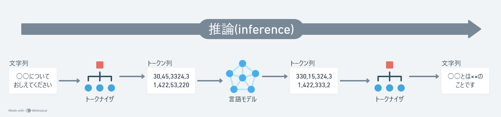
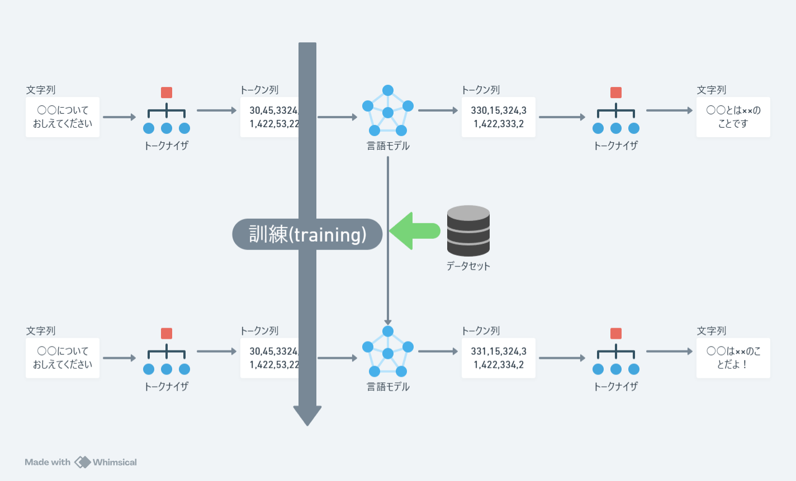
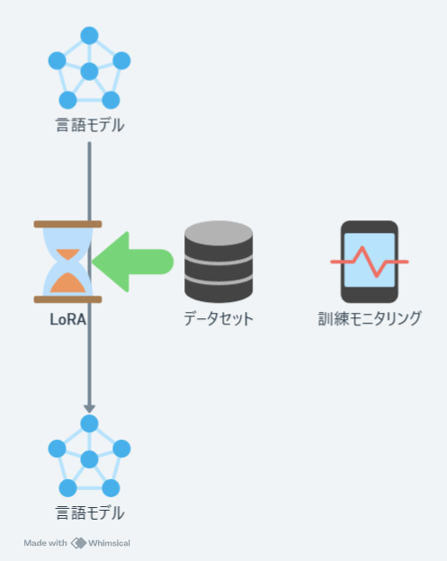
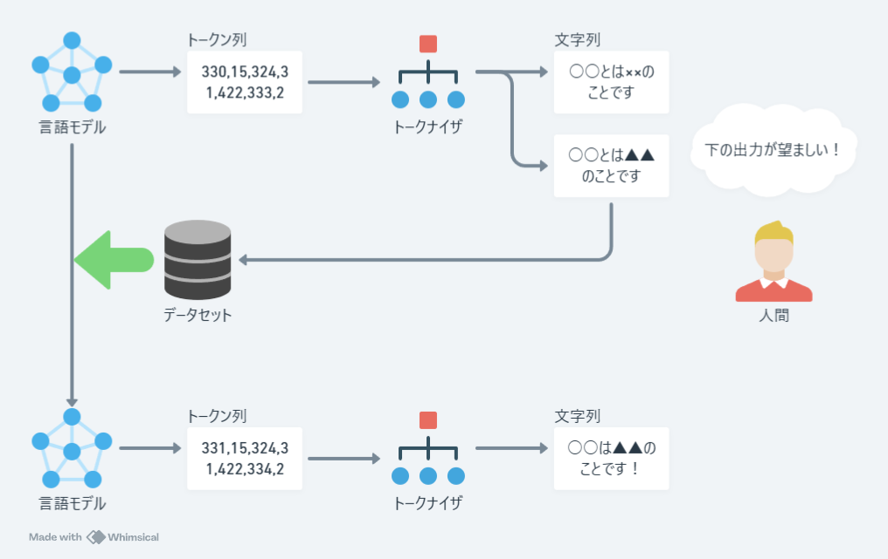
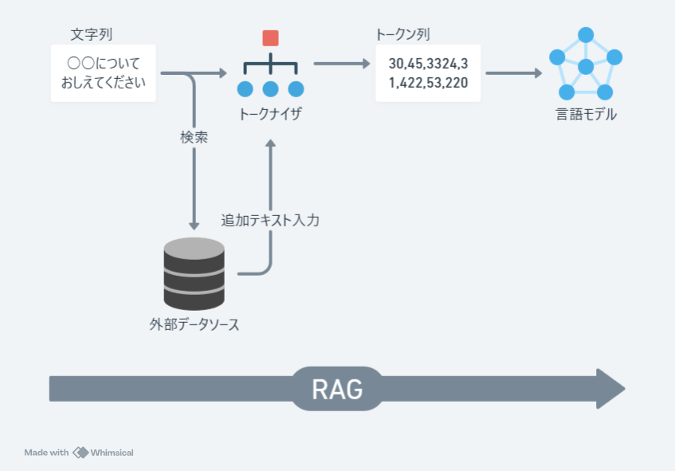
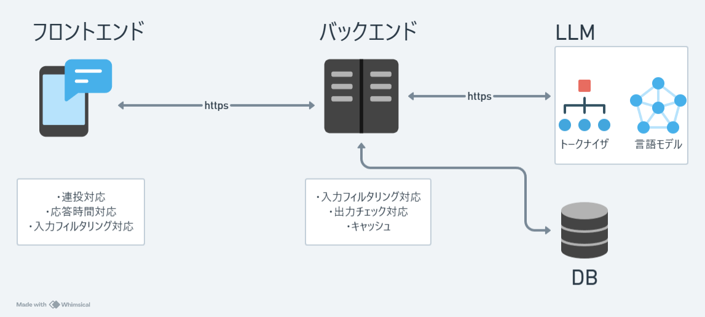

# 勉強会ふりかえり

- 言語モデルはトークン(整数)列を渡すとトークンを返してくれる関数であり、LLMの出力はこの関数を繰り返し適用していくことで達成されるということを学んだ
- パラメータ数は数十億という単位オーダーであり、一般のPCだと扱いづらいということを学んだ
- 文字列を言語モデルが受け取れるトークン列に変換するのにトークナイザという変換器が必要だということを学んだ
- 一連の横の流れを推論(inference)という

- 言語モデルはデータセットを食わせることで訓練する(パラメータを変化させる)ことができることを学んだ
- データセットのメモリ上でのフォーマットを学んだ(dataset, dataloader, data collatorの回)
- 一連の縦の流れを訓練(training)またはファインチューニングという
- トークナイザも訓練でき、訓練アルゴリズムとして3種類を学んだ

- 学習率、エポック数などの設定に関するファインチューニングの基本的お作法を学んだ(ハイパーパラメータの回)
- 訓練の様子をモニタリングすることでコントロールできることを学んだ(wandbの回)
- 可変パラメータを限定することで訓練時に計算量とメモリを節約するテクニックを学んだ(RoLA)

- ファインチューニングにはいくつかの種類がある
- 人間の選好をモデルに反映させる新しいファインチューニング手法を学んだ(学習コストが大きいため未実施)

- 外部リソースを検索し活用することで、LLMへのより適切な入力を模索できることを学んだ(ただし不確実な技術だとおもう)
- LLMへの入力を制御する手法を総称してプロンプトエンジニアリングといい、RAG(検索拡張生成)はその一手法である
- LLM自体を制御する手法(ファインチューニング)との対比でとらえられることが多い

# 世界のオープンLLM事情ふりかえり
- [2023, year of open LLMs](https://huggingface.co/blog/2023-in-llms)
## 要約
- 2022年はモデルサイズが大きいほど（つまり、パラメータが多いほど）パフォーマンスが向上するという考え方が主流だった。特に、特定のサイズの閾値を超えるモデルが能力を飛躍的に向上させるように見え、これらの概念は創発的能力(emergent abilities)とスケーリング則(scaling laws)と呼ばれていた
- 2023年に入って、モデルサイズよりも学習トークン数のほうが大事なファクターじゃね？という考えがあらわれ、それに従って比較的小規模なLLMが多くあらわれた
- LLMはベースモデルと対話モデルをセットでリリースするのがお作法。対話モデルの作成にはベースモデルからさらにファインチューニングといって追加学習をすることが必要。これらの手法がいろいろ考案された
    - instruction tuning
    - RLHF
- 対話モデルの作成と並行して特定ドメインのデータセットの作成や公開もコミュニティ内では活発に行われるようになった
- LLMをパーソナライズする(自分だけのLLMをつくる)手法もいろいろ考案された
    - モデルマージ
    - PEFT
    - 量子化
- 今後どうなっていくのかわからないけど以下の2つ注目してる
    - Mixture of Expert
    - 状態空間モデル(Mamba, Striped Hyena)

トランスフォーマに置き換わるアーキテクチャなんかもあらわれるかも！

# OpenAIリリース2023ふりかえり
優良クローズドLLM絶対王者OpenAIの動向も振り返っておきたい
- [ChatGPT — Release Notes](https://help.openai.com/en/articles/6825453-chatgpt-release-notes)

## 要約
|日付      |リリース                      |説明|
|----------|-----------------------------|-----------|
|2023/03/14| Announcing GPT-4 in ChatGPT | GPT4の登場 |
|2023/03/23| Introducing plugins in ChatGPT |プラグインの登場|
|2023/05/24|iOS app available in more countries, Bing Plugin |iOSアプリ、Bingプラグイン|
|2023/07/06|Code interpreter is now rolling out in beta on web| コードインタープリタ |
|2023/08/21|Custom instructions are now available to free users| ファインチューニング? |
|2023/09/25|New voice and image capabilities in ChatGPT|音声と画像対応|
|2023/10/16|DALL·E 3 is now rolling out in beta|画像生成|
|2023/10/17|Browsing is now out of beta|検索機能?|
|2023/11/06|Introducing GPTs|カスタムモデルストア?|
|2024/01/10|Introducing the GPT Store and ChatGPT Team plan|カスタムモデルストア?|
|2024/02/13|Memory and new controls for ChatGPT|

それから最近動画生成の機能出してたような?
誰かこの流れの解釈をお願いいたします。

# 個人ふりかえり
- 雑談チャットアプリのリリースを目指していたが未達成。成果ゼロ。
    - Google colabのA100インスタンスとHuggingFaceに転がっている公開データセットでファインチューニング
    - 途中の3か月はデータセット作成に注力(2000レコードのみ)しファインチューニング、出力結果は微妙
    - RLHFを実施してモデルを洗練させるまで至らなかった
    - フロントエンドは全く手つかず
- 2023年にLLM関連で一山あてた個人(あるいは少数ベンチャー)は存在するのかと思い、注視していたアプリ(時系列順)
    - [AirFriend](https://airfriend.ai/ja/)
    - [SynClub(中華系)](https://www.synclubaichat.com/)
    - [Cotomo(音声アプリ)](https://cotomo.ai/)
- CotomoはUIに関してはとても斬新だしクオリティが高いけど、それでも個人的にはまだ毎日使いたい気持ちにはなっていない
    - LLM仕草(特定の文字列をリピートするモードに入るときがある)
    - プロンプトインジェクション対応
    - 音声/文字変換特有の問題

# クオリティの高いLLMアプリケーションを開発するために
## 計算リソース(特にメモリ)の壁
- 目安として10B(100億)パラメータのLLMを稼働するには22GBのメモリが必要
- 目安としてEC2のp2.xlargeインスタンス(61GiB)は0.9$/h(150円)、単純計算しても計算リソースだけで最低毎月100,000円以上の費用がかかる
- よっぽどの人気が出て回収できないかぎり、今のところ全く現実的ではない！

## ファインチューニングの壁
- 価値のあるLLMを作成するためにはLLMを特定ドメイン応答に特化したファインチューニングをしないといけない。
- ファインチューニングにはデータセットが必要だが、公開データセットで学習しているかぎり差別化は不可能
- 価値のあるデータセットを自作しないといけない！
- ファインチューニングはSFTとRLHFの2段構成が基本だが、RLHFは特に学習リソースが高い(自分も未経験)

## 打開策1:優等LLMのAPI(現実的)
- 計算リソースもなんならファインチューニングさえもアウトソーシングできる
- OPENAIのGPT-4, AnthropicのCluade3, GoogleのGemini。これらに毎月API使用料を払って商用利用させていただく。とても現実的。
- その中でもやはりOPENAIを主軸に持ってくるのが無難　
- ただし、優等LLMをベースにして差別化されたアプリケーションを作れるか？と言われると疑問
- UIを含めた全体設計が肝になる予感

### 打開策2:ビットトランスフォーマー(願望)
- 最近既存のトランスフォーマーモデルの全てのパラメータを-1,0,1の3値に置き換えるみたいなのが出てきた。これでもレスポンスクオリティが維持されるなら計算リソースにおいては大きなブレークスルーになる。
- 具体的には1パラメータがfloatの32bitから1.58bitになるから約20倍削減できる。メモリ問題の解決が見える。
- 出力クオリティの確認が必要

## ユーザーインターフェイスの壁
せっかくレスポンスの中身自体は人間っぽくなってきたのに、レスポンスの仕方自体が従来のウェブUIから一歩も進まないのはもったいない。既存のウェブアプリやネイティブアプリとは根本的に異なるUIを設計することが必須になる。

たとえばテキストチャットアプリのフロントエンドでは、
- ユーザーからの連投にどう対応するか
- 決して短くない応答時間をどのように演出するか
などを総合的に考える必要がある。音声チャットアプリの場合もさらに考慮することは増える。またバックエンドではLLM出力の不安定さを補完するために、
- 入力をフィルターしたり(プロンプトインジェクション対策)、
- 出力をチェックしたり(レスポンスクオリティの担保)するべき

音声や画像に対応すると、UIはさらに未知のものになる。今後は野良LLMにこだわらず優等LLMのAPI(GPT4, Claude3, Gemini)も視野に入れながら、よさげなUIを模索していく。
