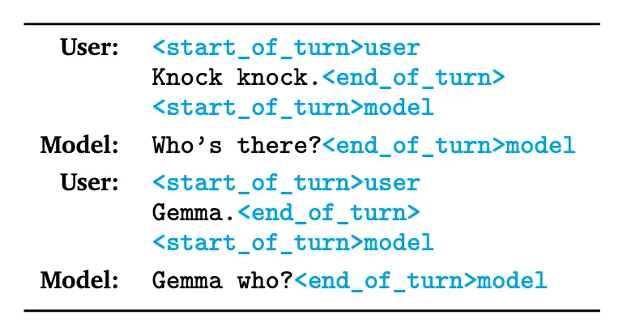

# コンテンツ
1. ファインチューニングとは
2. データセットとは
3. プロンプトフォーマット
4. ハイパーパラメータとの格闘
5. Huggingface特有の事情
6. まとめ

# 1. ファインチューニングとは
言語モデルを独自データセットで追加学習すること。パラメータが変化することで、独自データセットを反映するような出力が期待できる。追加学習では、以下のようなタスクを学習させることが多い
- 次トークン予測
- 分類
入力データに対応したラベリングデータを食わせる教師あり学習を指すことが多い。

# 2. データセットとは
- 構造化データ(テーブルデータ、json、csvなど)
- [具体例](https://huggingface.co/datasets/PleIAs/common_corpus)
- 1行がひとつのレコードに相当、レコードには複数のカラム要素がある


# 3. プロンプトフォーマット
- 前提として、だいたいの言語モデルには「ベースモデル」と「インストラクションモデル」の2種類がある。
- この２つのモデル構造は同じだが、学習データが異なり、結果としてパラメータが異なる。
- ベースモデルは既存のデータソースでひたすら次トークン予測で学習させたもの←(この場合、「ベースモデルはひたすら次トークン予測で学習させたも」から「の」を予測させる学習)。それっぽい日本語を覚えるようになる。
- インストラクションモデルはベースモデルをファインチューニングしたもの。「指示」と「応答」をセットにしたプロンプトを組んで、「応答」部分を予測させる。やっていることはベースモデルと同じ次トークン予測だが、フォーマットを固定するところがポイント。

### 例) gemma2-itのフォーマット


### 例) llama3.1-itのフォーマット


- 自分でファインチューニングするときの注意として、インストラクションモデルをさらにファインチューニングする際は、インストラクションモデルをチューニングした際に用いられたプロンプトフォーマットを用いることが大事(なのではないかと思っているが、別にそこまで大事ではないかもしれない)

# 4. スペシャルトークン
前提として、モデルの学習にはトークンボキャブラリが必要。
- トークンボキャブラリというのは、そのモデルが扱うことのできるトークンの集合
- 任意の文字列を<なにかしらのアルゴリズムによって>トークン列に変換するツールのことをトークナイザという

ここから実用的なこと。
既存のモデルをファインチューニングする際に、新しいトークンがほしくなることがある。
たとえば<user_name>みたいなトークンがあれば便利そう。
そのときにトークンボキャブラリに新しいトークンを登録しておかないと、トークナイザがこれを認識しない。

# 5. ハイパーパラメータとの格闘
- ファインチューニングにおいては、データセットを準備したなら、あとはハイパーパラメータをいじって祈るくらいしかわれわれにできることはない。ハイパーパラメータとはたとえば以下のようなものである。
[ハイパーパラメータの例](https://huggingface.co/docs/trl/main/en/sft_trainer)
```python
args = TrainingArguments(
    output_dir="gemma-japanese",            # directory to save and repository id
    num_train_epochs=3,                     # number of training epochs
    per_device_train_batch_size=2,          # batch size per device during training
    gradient_accumulation_steps=2,          # number of steps before performing a backward/update pass
    gradient_checkpointing=True,            # use gradient checkpointing to save memory
    optim="adamw_torch_fused",              # use fused adamw optimizer
    logging_steps=10,                       # log every 10 steps
    save_strategy="epoch",                  # save checkpoint every epoch
    learning_rate=2e-4,                     # learning rate, based on QLoRA paper
    bf16=True,                              # use bfloat16 precision if you have supported GPU
    tf32=True,                              # use tf32 precision if you have supported GPU
    max_grad_norm=0.3,                      # max gradient norm based on QLoRA paper
    warmup_ratio=0.03,                      # warmup ratio based on QLoRA paper
    lr_scheduler_type="constant",           # use constant learning rate scheduler
    push_to_hub=True,                       # push model to hub
    report_to="tensorboard",                # report metrics to tensorboard
)
```
この中で絶対知っておいたほうがいいものを大事な順(独断)に紹介する
## Lr(learning rate)
学習率。αと言ったりもする。
学習率はパラメータ空間で次の場所に移動するときの移動幅のこと。大きいと大胆に学習し、小さいと慎重に学習する。大きいと正解を見逃すリスクがあり、小さいと正解にたどりつけないリスクがある。
これがなんなのかは絶対に知っておいたほうがいいが、値はデフォルトの値でよい。やってみて微妙なら上げたり下げたりする。

## batch,epoch,step
よく使う。混乱必至。
batchはモデルに1回でわたすレコード数、epochはデータセットを何周するか、stepはモデルにわたす回数。

#### 10,000レコードのデータセットをバッチ数2で3エポック学習するときのステップ数は？
こたえ15,000(steps)
ちなみに基本はstep数分だけパラメータの再計算プロセスがあるが、`gradient_accumulation_steps`というのは、何回のstepで再計算をおこなうかという指標。


- モデルの学習の前に必ずトークナイザの学習がある
- トークナイザの学習によって、トークンボキャブラリが固定化される


## ファインチューニングの前処理
自分で作成した(あるいは事前に用意されている)データセットをモデルに学習してほしい形に変換する処理。
 - データセットをプロンプトに組み込む
 - 必要な特殊トークンを追加する


## ここからは`huggingface`系列のライブラリ固有の話
- huggingfaceは以下のライブラリ群を提供していて、それぞれが依存していてわかりづらい
    - 様々なモデルの推論と学習を担う`transformers`
    - 文字列のトークン化に特化した`tokenizer`
    - finetuningにより特化した`trl`
    - LoRAなどをおこなう`peft`
    - たとえば`model`と`tokenizer`がペアであるのはいいとして、プロンプトが`tokenizer`によって管理されている
- 基本メソッドに引数が多すぎるうえに、デフォルトの動きが読みづらい
