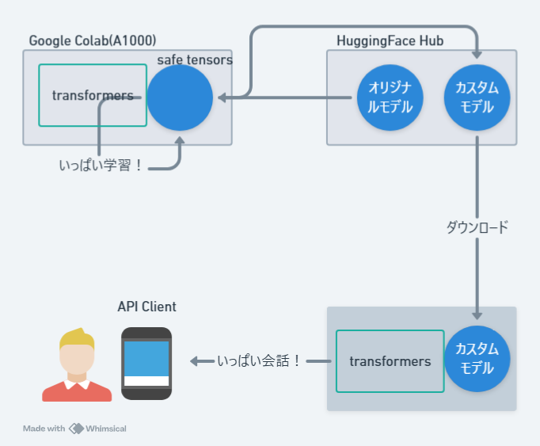
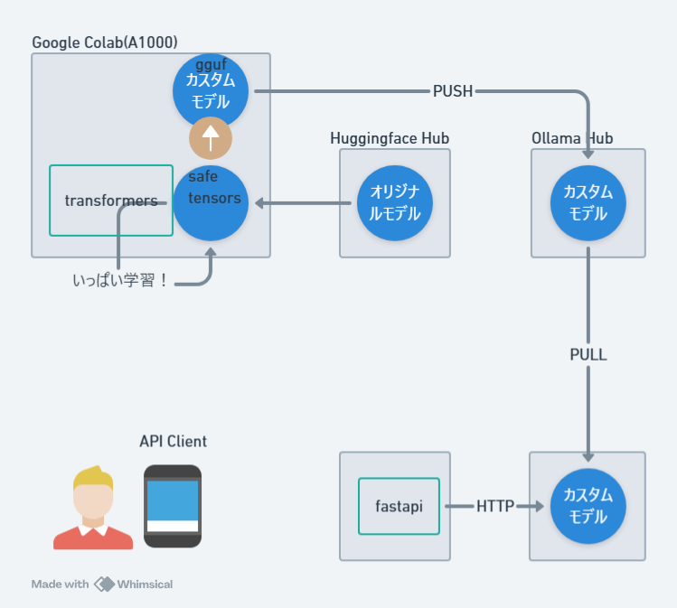

# 現状


# やりたいこと


# なぜかいまこうなってる

[osakagpt/deploy_ollama_phi3](https://github.com/osakagpt/deploy_ollama_phi3)

# 同じモデルでも公開される形式が異なる
- [safe tensors形式](https://huggingface.co/microsoft/Phi-3-mini-4k-instruct)
- [onnx 形式](https://huggingface.co/microsoft/Phi-3-mini-4k-instruct-onnx)
- [gguf 形式](https://huggingface.co/microsoft/Phi-3-mini-4k-instruct-gguf)

# `ollama run phi3`
を実行したら以下のマニフェストファイルが生成された

同時に`layers`の項目にある4つのblobsファイルも生成されていた(ひとつは2.3GBある)
```
{
  "schemaVersion": 2,
  "mediaType": "application/vnd.docker.distribution.manifest.v2+json",
  "config": {
    "mediaType": "application/vnd.docker.container.image.v1+json",
    "digest": "sha256:f91db7a2deb93f418f7493fe76eaee189cfbdf4a49b4f2c3a41e9e56161d7ef9",
    "size": 485
  },
  "layers": [
    {
      "mediaType": "application/vnd.ollama.image.model",
      "digest": "sha256:b26e6713dc749dda35872713fa19a568040f475cc71cb132cff332fe7e216462",
      "size": 2393231168
    },
    {
      "mediaType": "application/vnd.ollama.image.license",
      "digest": "sha256:fa8235e5b48faca34e3ca98cf4f694ef08bd216d28b58071a1f85b1d50cb814d",
      "size": 1084
    },
    {
      "mediaType": "application/vnd.ollama.image.template",
      "digest": "sha256:542b217f179c7825eeb5bca3c77d2b75ed05bafbd3451d9188891a60a85337c6",
      "size": 148
    },
    {
      "mediaType": "application/vnd.ollama.image.params",
      "digest": "sha256:8dde1baf1db03d318a2ab076ae363318357dff487bdd8c1703a29886611e581f",
      "size": 78
    }
  ]
}
```

# ggufファイルとblobsファイルのちがいとは？
ChatGPT4-o先生の回答
> 
> ## GGUFファイル
>
> ### 目的:
> 
> .ggufファイルは、モデルのアーキテクチャ、メタデータ、設定、および重みを含む包括的な情報を保存するために使用される特殊なファイル形式です。
> 機械学習モデルを再現および展開するために必要なすべてのコンポーネントをカプセル化するコンテナとして機能します。
>
> ### 構造:
> 
> メタデータ、設定、シリアライズされたモデルの重みなど、複数のセクションや部分を含む構造化された形式を持つことが多いです。
> 構造は複雑で詳細であり、モデルの重みだけでなく、モデルの使用方法や展開方法に関する情報も含まれます。
> ### 使用法:
> 
> GGUFファイルは、機械学習モデルを必要なすべてのコンポーネントと共にパッケージ化および配布するために使用されます。
> さまざまな環境でのモデルの簡単な共有と展開を可能にし、自己完結型のパッケージを提供します。
> ### 例の内容:
> 
> メタデータ: モデル名、バージョン、作者
> 設定: ハイパーパラメータ、アーキテクチャの詳細
> 重み: シリアライズされたモデルパラメータ
> 追加データ: トークナイザーの設定、トレーニングの詳細
>
> ## ブロブファイル
>
> ### 目的:
> 
> 機械学習の文脈でのブロブ（Binary Large OBject）ファイルは、通常、シリアライズされたモデルの重みやパラメータをバイナリ形式で保存するファイルを指します。
> 主な目的は、学習されたモデルのパラメータを効率的に保存し、後で使用することです。
>
> ### 構造:
> 
> ブロブファイルは通常、シリアライズされたデータを含む単純なバイナリファイルです。GGUFファイルのように複雑な構造や複数のセクションはありません。
> コンパクトな保存と高速な読み込みのために最適化されていますが、人間には読み取れません。
> ### 使用法:
> 
> ブロブファイルは、モデルの重みを保存および読み込むために使用されます。通常、他の設定ファイルやマニフェストファイルによって参照され、そのデータの解釈と使用に必要なコンテキストを提供します。
> 大規模なシステムの一部として使用され、他のファイルが必要な設定やメタデータを提供します。
> ### 例の内容:
> 
> モデルの重みやパラメータを表す純粋なバイナリデータ。
> モデルの設定や使用に関する追加情報は含まれません。
> まとめ
> GGUFファイル: モデルのメタデータ、設定、およびシリアライズされた重みなど、必要なすべてのコンポーネントを含む包括的で自己完結型のファイル形式。
> ブロブファイル: シリアライズされた重みやパラメータを保存するための単純なバイナリファイル形式。通常、他のファイルによって参照され、そのデータの使用に必要なコンテキストが提供されます。
> 実践の例
> Ollamaサーバでモデルを展開する場合、GGUFファイルはモデルに必要なすべてをパッケージ化し、サーバがモデルを完全に再現および展開できるようにします。一方、ブロブファイルは、実際のモデルの重みを含むコンポーネントであり、GGUFファイルやマニフェストファイルによって参照されます。
> 
> 以下は、モデルブロブを参照するマニフェストファイルの簡単な例です：
> 
> ```yaml
> model_name: example_model
> version: 1.0
> architecture: transformer
> tokenizer:
>   type: BPE
>   vocab_size: 50000
> blobs:
>   - path: model_weights.bin
>     type: weights
>     description: シリアライズされたモデル重み
> dependencies:
>   - torch>=1.7.0
>   - transformers>=4.0.0
> config:
>   max_length: 512
>   batch_size: 16
> ```
> この例では、blobsセクションでモデルの重みを含むバイナリファイル（model_weights.bin）のパスを指定しています。マニフェストは、サーバがこれらの重みを正しく読み込み、使用できるようにするための必要なコンテキストを提供します。
>

どうやら各種ライブラリが直接読み込むのがblobファイルらしい。

# 問題は
- ollamaサーバのコンテナイメージもなるべく軽量にしたい
  - コンテナ起動してからggufはダウンロードしてcreate model
  - むしろ事前にcreateしてblobファイルをollama hubに事前にpushしておいて、コンテナ起動後にpullするだけにするのがいい
- モデルのロード時間。なるべく短くしたい
  - モデルサーバーでサーバーレスは非現実的。
  - 一度たちあげたらたちあげっぱなしにするしかない？
