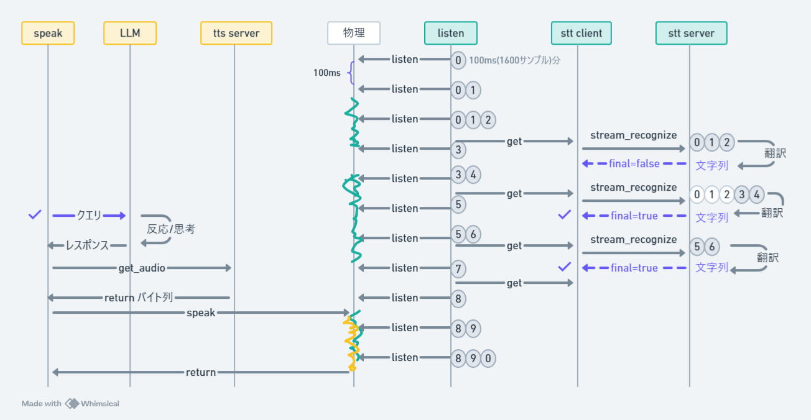

# 現状
- 音声インターフェイスで自然にやりとりできるチャットボットを作りたい！
- 自然に→まるで人間と話しているように
- この夏OpenAIがマルチモーダルなモデルを発表してより自然な音声インターフェイスに対応したが(gpt4o ボイスモード)、これが万民に開放されることはないと推測している
- STTやTTSを用いる古典的な音声インターフェイスの実装は健在であるどころか需要は増していく！

# STT(Speach to Text)とTTS（Text to Speach）
- 古典的なLLMは文字列を入力として受け取り、文字列を出力するため、前後にSTTとTTSが必要になる
## STT
- 抑揚や感情、環境音など様々な情報を捨てるので情報量は落ちる
- STTには通常を意味を判断する機構がついており、それが分類タスクをよりよく機能させる

## TTS
- 反対に情報量が増えるためいろんな余地がある
- いろいろ不明

## 2か月近く前からこれを参考にして実装しているが、、
- [LLM音声対話システムの応答を高速化してみた](https://developers.cyberagent.co.jp/blog/archives/44592/)

# 処理の流れ

# 問題点
- Speak中断機能がない(ListenはSpeakよりも優先度が高い)
    - 物理層で自らがSpeakしたものをListenしてしまう問題はこれで解決できるのか？
    - できないなら話者認識機能を追加する必要がある
- Speak上書き機能がない(Finalが立て続けに来た時に、全てにthinkしてSpeakいたら遅くなる)
- Speak補強機能がない(Finalがぜんぜんこないときに適度なあいづちを打ちたい)
